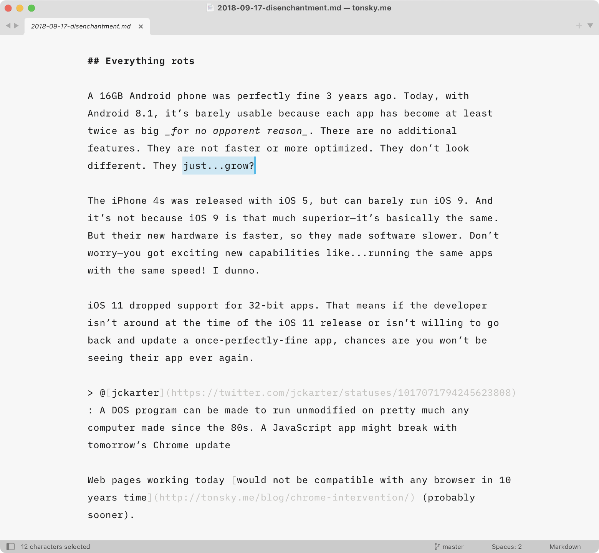

# Writer—Font for Long-Form Writing

A version of [iA Writer Mono](https://github.com/iaolo/iA-Fonts/tree/master/iA%20Writer%20Mono) with increased letter-spacing and tuned weights.

Great fit for long-term writing.

If you like it, consider buying [iA Writer](https://ia.net/writer). It does a lot more for writing beyond just having great font.

## Installation

macOS: copy `*.ttf` to `~/Library/Fonts`

Windows: copy `*.ttf` to `C:\Windows\Fonts`

Linux: copy `*.ttf` to `~/.local/share/fonts/`, run `fc-cache -f`

## See also

[Writer Color Scheme](https://github.com/tonsky/sublime-scheme-writer): A color scheme optimized for long-form writing.

[Profile Switcher](https://github.com/tonsky/sublime-profiles): Plugin for quickly switching profiles.

[Alabaster Color Scheme](https://github.com/tonsky/sublime-scheme-alabaster): Minimal color scheme for coding.

[Fira Code](https://github.com/tonsky/FiraCode/): Best coding font in the world.

## Credits

IBM Plex by [Bold Monday](https://boldmonday.com/).

iA Writer Mono by [iA](https://ia.net/).

Repackaged by [Niki Tonsky](https://twitter.com/nikitonsky).

## License

[OFL License](./LICENSE.txt)